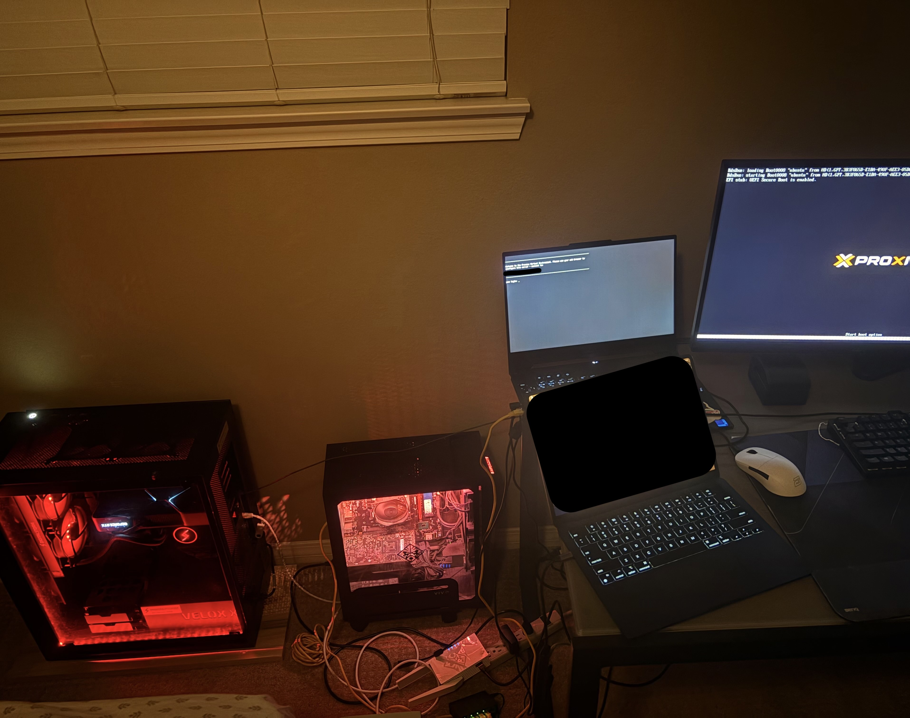

# Home-Cloud

A self-hosted home cloud built on three spare computers using Proxmox VE and Tailscale. All three nodes run bare-metal Proxmox, are accessible remotely via Tailscale from anywhere in the world, and have dedicated GPUs passed through to Ubuntu VMs for compute workloads. This repository documents the complete build process and serves as a reproducible guide.

### Current Physical Server Setup



## Motivation

- Privacy-first project hosting — no third-party data exposure
- No monthly recurring cloud costs
- Repurpose spare hardware into a capable compute cluster

## Architecture

| Layer | Technology | Role |
|---|---|---|
| Hypervisor | Proxmox VE | Type-1 bare-metal OS managing all VMs and containers on each node |
| Network | Tailscale | Encrypted WireGuard tunnel for secure remote access without port forwarding or VPN setup |
| Workloads | KVM VMs / LXC Containers | Isolated environments for projects and GPU compute |
| Container Runtime | Docker + NVIDIA Container Toolkit | GPU-accelerated containerized workloads |

Each node runs Proxmox directly on the hardware (replacing Windows). Project workloads run inside VMs or containers managed by Proxmox. Tailscale provides each node with a stable `100.x.x.x` IP address reachable from any device on the same Tailscale network, regardless of physical location.

## Cluster

All three nodes are members of a single Proxmox cluster named **`home-cluster`**, managed through a unified Proxmox dashboard. This allows VMs and resources to be viewed and managed across all nodes from a single interface.

| Node | Hardware | Proxmox Hostname | GPU | Tailscale |
|---|---|---|---|---|
| Node 1 | ASUS Laptop | `pve` | NVIDIA RTX 3050 Mobile | `100.x.x.x:8006` |
| Node 2 | Desktop PC | `pve-node2` | NVIDIA GTX 1060 | `100.x.x.x:8006` |
| Node 3 | Desktop PC | `pve-node3` | NVIDIA RTX 3080 | `100.x.x.x:8006` |

All nodes have GPU passthrough configured via VFIO, with NVIDIA drivers and CUDA installed in their respective Ubuntu VMs.

## Remote Access

The Proxmox web dashboard for any node is accessible from the Mac at:

```
https://<node-tailscale-ip>:8006
```

No port forwarding or public IP is required. Tailscale handles NAT traversal automatically. The nodes live at a remote location; the Tailscale tunnel is the only way they are accessed.


## Supported Workloads

The cluster's combined GPU resources (RTX 3050 + GTX 1060 + RTX 3080) support:

- LLM inference (e.g., Ollama, vLLM)
- Stable Diffusion image generation
- PyTorch / CUDA model training
- Docker-based AI services

## Documentation

For the full technical build log, including step-by-step commands, configuration tables, VM specs, GPU passthrough setup, the VM template strategy, and all troubleshooting notes, see [how_this_was_built.md](how_this_was_built.md).
